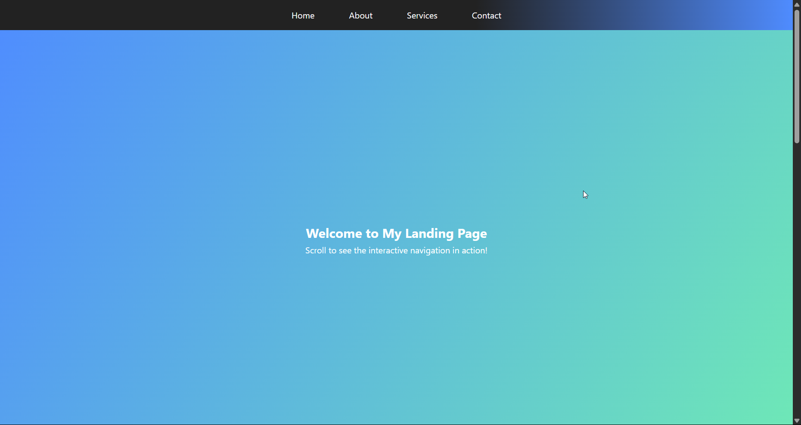

# Prodigy InfoTech - Web Development Internship

## Task 01 - Responsive Landing Page

### 📌 Description:
Created a responsive landing page with a fixed navigation bar. The navbar dynamically changes background or font color on scroll and hover, enhancing the UI experience.

### 💻 Technologies Used:
- HTML
- CSS
- JavaScript

### 🚀 Features:
- Responsive Design
- Fixed Navigation Bar
- Scroll & Hover Effects
- Clean UI/UX

### 📸 Preview:

---

**Repository Maintained By:**  
👨‍💻 Sudhanshu Yadav  
